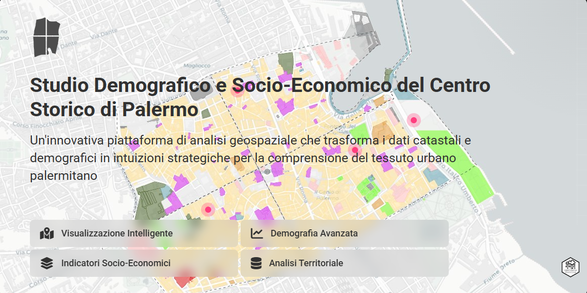
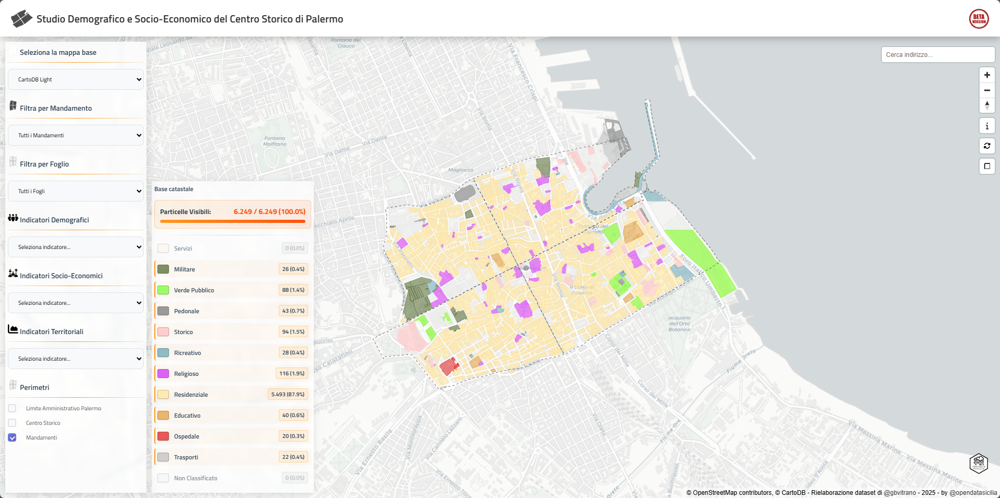
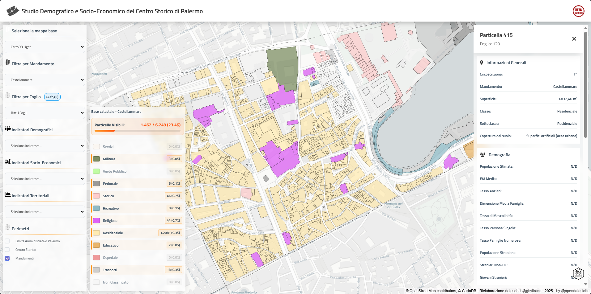

# Studio Demografico e Socio-Economico del Centro Storico di Palermo
Un'innovativa piattaforma di analisi geospaziale che trasforma i dati catastali e demografici in **insights** strategici per la comprensione del tessuto urbano palermitano.
#### **Funzionalità principali:**
- **Visualizzazione Intelligente** - Esplora le particelle catastali con classificazione automatica dell'uso del suolo e indicatori territoriali avanzati.
- **Demografia Avanzata** - Analisi della popolazione residente, composizione per età, struttura familiare e dinamiche migratorie.
- **Indicatori Socio-Economici** - Livelli di occupazione, istruzione, integrazione lavorativa e resilienza economica del territorio.
- **Analisi Territoriale** - Densità abitativa, caratteristiche morfologiche, valutazione rischi ambientali e potenziale immobiliare.
- **Filtri Dinamici Interconnessi** - Sistema avanzato per Mandamenti e Fogli di mappa e colori legenda con aggiornamento in tempo reale
- **Auto-centraggio Intelligente** - La mappa si centra automaticamente sulle aree filtrate
#### **Come Utilizzare la Piattaforma:**
- **Seleziona un Indicatore:** Utilizza i menu tematici per visualizzare Demografia, Economia o Territorio
- **Esplora i Dettagli:** Clicca su qualsiasi particella per accedere ai dati specifici nel pannello laterale
- **Filtra per Area:** I filtri si aggiornano automaticamente - seleziona un mandamento per vedere solo i suoi fogli. La mappa si centrerà automaticamente sull'area selezionata. legende interattive che fungono da filtri. Funzionalità standard nelle moderne applicazioni di data visualization e mapping. Cliccare sui colori/elementi della legenda per attivare/disattivare i relativi dataset è una UX pattern molto comune e intuitiva.
- **Cerca Indirizzi:** Utilizza la ricerca geografica ottimizzata per il centro storico di Palermo
## 📤 **Funzionalità di Condivisione**
### **Cattura completa dello stato**:
- ✅ Basemap selezionato (CartoDB, OSM, Google Maps, Satellite)
- ✅ Mandamento filtrato
- ✅ Foglio filtrato  
- ✅ Tema corrente (sia categorici che Jenks-Fisher)
- ✅ Perimetri attivi (Palermo, Centro Storico, Mandamenti)
- ✅ Stato dei bordi
- ✅ Filtri della legenda
- ✅ Posizione e zoom della mappa (tramite hash)
-----
**Fonte dati:**\
[zornade.com](https://zornade.com/) - Italian Cadastral Parcel Data & Geospatial Insights API

**Sviluppo tecnico:**\
Applicazione web sviluppata attraverso una collaborazione human-[Claude AI (Anthropic)](https://claude.ai), che ha supportato la progettazione dell'architettura modulare, l'ottimizzazione del codice e l'implementazione di funzionalità avanzate di visualizzazione geospaziale. Il progetto rappresenta un esempio concreto di come la collaborazione tra sviluppatori e intelligenza artificiale possa trasformare concetti complessi in soluzioni software efficienti e scalabili.

**Elaborazione dati:**\
[@gbvitrano](https://www.linkedin.com/in/gbvitrano/) by [@opendatasicilia](https://x.com/opendatasicilia "@opendatasicilia") - 2025 - [Licenza CC BY 4.0](https://creativecommons.org/licenses/by/4.0/deed.it)

